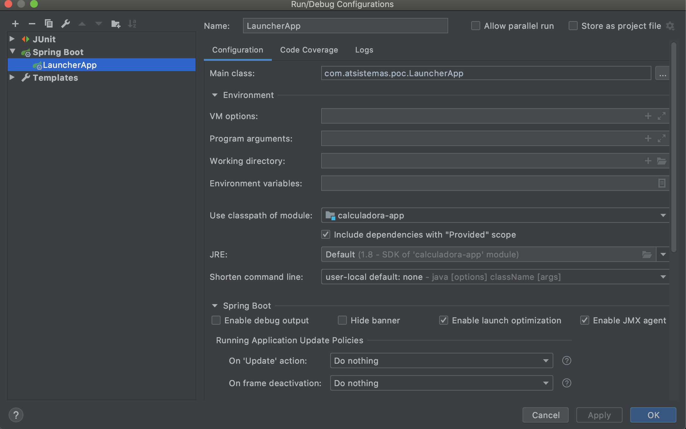
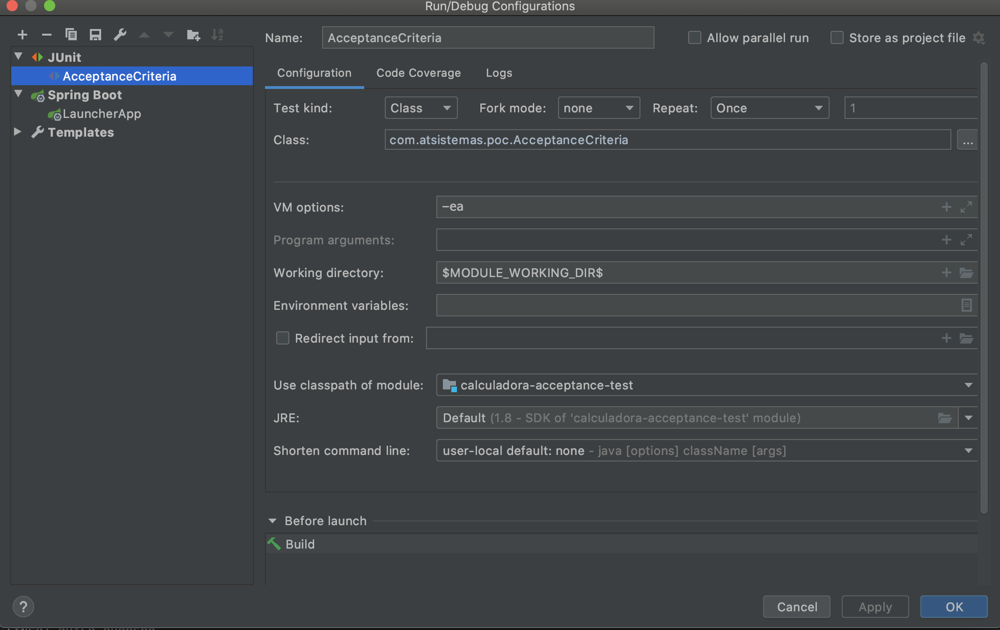

SOLUCION TECNICA
===========
Para el desarrollo del micro-servicio se ha aplicado:
* Principio SOLID
* TDD  
* ATDD (con Karate + Cucumber)
* API First 

INSTALACION e EJECUCCION
===========
###Prerequisitos
* JAVA 8
* MAVEN

###Installacion
Ejecuctar el comando:
    mvn clean install

El entregable es generado en calculador-app/target/calculadara-app.jar

###Ejecución App
```bash
cd calculador-app/target
java -jar calculadara-app.jar
```
###Ejecución Test Integracion
* Ejecución App



* Ejecución Test




